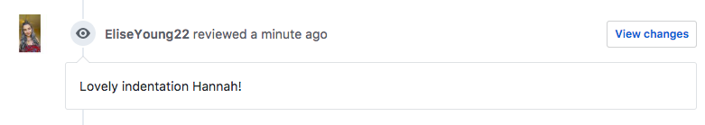

# Sprouted [](https://travis-ci.org/hannahcancode/CFA-major-project-2) [](https://codeclimate.com/github/hannahcancode/CFA-major-project-2)

## About

'Sprouted' is a major project for the Coder Factory Academy Diploma of Software Development Course.

### What is Sprouted?
- Sprouted is a Ruby on Rails web app that aims to make a small step in increasing the food security of communities by getting people back in touch with the land.

- Sprouted connects would-be farmers and gardeners to people who have unused space, such as landholders and councils.


- In the future it will:

  - provide a marketplace for the sale or swap of garden produce

  - allow for the donation of excess produce to those in need.


## Setup
### Installation
- create a local copy by cloning the repository:

  `$ git clone https://github.com/hannahcancode/CFA-major-project-2.git`


- run `$ bundle` to install gem dependencies


- create and migrate the postgresql database:

  ```bash
  $ rails db:create
  $ rails db:migrate
  ```

### Running

- run `$ rails s` to start the server


- navigate to `localhost:3000` in your web browser to view the site

### Testing

- tests for this applicaiton are written with rspec. To run:

  `$ bundle exec rspec`

- they are also run automatically by Travis CI - check the build button at the top of this repository to see whether the master is currently passing tests.

## Project Management

### Problem Statement and Solution

Densely populated cities and urban sprawl has removed people from the land and put them in apartment buildings and units with minimal outdoor space. This in turn removes the ability for communities to be food secure - they cannot grow their own food because they do not have the space to grow it. Children growing up in these environments lack the exposure to the origin of their food, and thus lack an understanding of the difference between healthy, homegrown fruit and vegetables and more heavily processed food bought from a supermarket.

Conversely, there is a large amount of under-utilised space within cities. Some homeowners are lucky enough to have gardens but lack the time, money or inclination to grow food in them. Businesses have rooftops that aren't being used because they have no need for the outdoor space. Councils have large amounts of land that aren't being used because they don't have the money to develop them.

Sprouted is a way of connecting this land with the people who have the time and desire to grow food on it. Sprouted helps people reconnect with where their food comes from.

### Wireframes


### Entity Relationship Diagram


### User Journey


### Trello


### Code review

